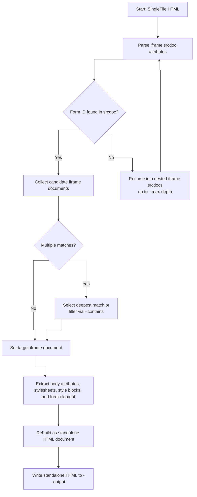

```mermaid
%%{ init: { 'flowchart': { 'curve': 'stepAfter', 'nodeSpacing': 100, 'rankSpacing': 80 }, 'useMaxWidth': false } }%%
flowchart TD
    %% Node Definitions
    A["Start: SingleFile HTML"]
    B["Parse iframe srcdoc attributes"]
    C{"Form ID found in srcdoc?"}
    D["Recurse into nested iframe srcdocs<br>up to --max-depth"]
    E["Collect candidate iframe documents"]
    F{"Multiple matches?"}
    G["Select deepest match or<br>filter via --contains"]
    H["Set target iframe document"]
    I["Extract body attributes, stylesheets, style blocks, and form element"]
    J["Rebuild as standalone HTML document"]
    K["Write standalone HTML to --output"]

    %% Direct vertical alignment for Main flow
    A --> B
    B --> C
    C -->|Yes| E
    E --> F
    F -->|No| H
    H --> I
    I --> J
    J --> K

    %% Lateral branches (out of corners horizontally)
    C -->|No| D
    D --> B
    F -->|Yes| G
    G --> H

    %% Invisible alignment links to force vertical/horizontal stacking
    C ~~~ D
    G ~~~ I
```
<!--  -->

```mermaid
%%{ init: { 'flowchart': { 'curve': 'stepAfter', 'nodeSpacing': 100, 'rankSpacing': 80 }, 'useMaxWidth': false } }%%
flowchart TD
    %% Node Definitions
    A["Start: HTML File"]
    B["Format HTML with indentation<br>and normalize whitespace"]
    C{"--no-css-pipeline?"}
    D["Extract inline style blocks"]
    E{"Style blocks found?"}
    F["Write to CSS file<br>Replace style blocks with link rel=stylesheet"]
    F2["Scan HTML for existing linked local CSS files"]
    H["For each CSS file"]
    I["Scan CSS for url(data:...) base64 assets"]
    J["Extract data URLs to a separate custom properties vars file"]
    K["Rewrite original CSS to use var(--...)"]
    L["Inject @import of vars file into original CSS"]
    M["Extract data:image and data:font to real files in assets/"]
    N["Update vars file to use url('assets/...')"]
    O["Format and beautify rewritten CSS"]
    P{"--no-extract-data-assets?"}
    Q["Scan HTML for remaining data: image/font assets"]
    R["Write assets to assets/ folder and rewrite HTML href/src tags"]
    S["Write final formatted HTML"]
    T["Done"]

    %% Direct vertical alignment for Main flow (Default pipeline)
    A --> B
    B --> C
    C -->|No| D
    D --> E
    E -->|Yes| F
    F --> H
    H --> I
    I --> J
    J --> K
    K --> L
    L --> M
    M --> N
    N --> O
    O --> P
    P -->|No| Q
    Q --> R
    R --> S
    S --> T

    %% Lateral branches (out of corners horizontally)
    C -->|Yes| P
    E -->|No| F2
    F2 --> H
    P -->|Yes| S

    %% Invisible alignment links to force vertical stacking
    F ~~~ F2
```
<!--  -->
